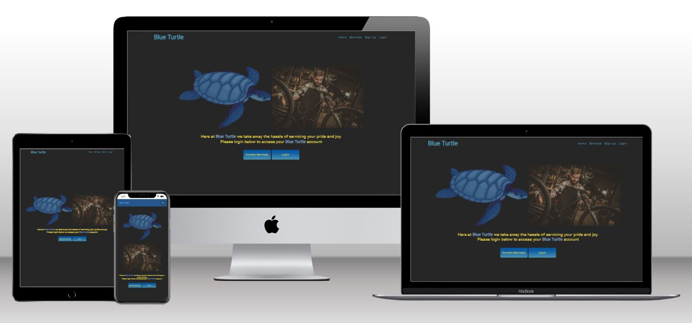
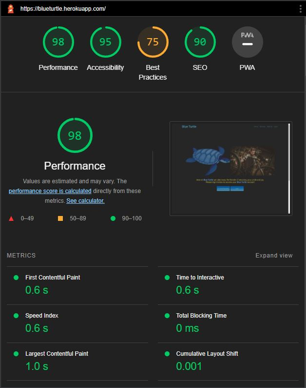

Welcome to my fifth Code Institute diploma project.

# INTRODUCTION AND OVERVIEW
For my fifth project I decided to create a bicycle service eCommerce store.

'**Blue Turtle**' is a simple eCommerce store where users can register an account with Blue Turtle Bicycle Servicing and purchase specific services.

# BLUE TURTLE

### **Live Project can be viewed:**  [HERE](https://blueturtle.herokuapp.com/)

### **The repository can be found here:**  [HERE](https://github.com/GaryCooper-pm/PP5-eCommerce-project)

## INITIAL IDEA CONCEPT

* My initial idea for this project was to create a simple eCommerce website that would enable people to create an account and purchase (via [Stripe.com](https://stripe.com/gb)) specific services for their bicycles.

## STRATEGY

* Blue Turtle is primarily focused on selling B2C products to end users.

## TARGET AUDIENCE

* Anyone who wants to have their bicycle serviced by a fully qualified mechanic.

#
## CONTENTS

- [DJANGO PROJECT CHECKLIST](#project-checklist)
- [USER STORY](#user-story)
- [FEATURES](#features)
    - [Wireframes](#wireframes)
    - [Models Diagram](#models-diagram)
    - [Design](#design)
- [TECHNOLOGIES](#technologies)
    - [Development](#development)
    - [Languages used](#languages-used)
    - [Frameworks, Libraries and Programs used](#frameworks-libraries-and-programs-used)
- [TESTING](#testing)
    - [Manual testing](#manual-testing)
    - [Testing User Stories](#testing-user-stories)
    - [Testing Admin User Stories](#testing-admin-user-stories)
    - [Validation](#validation)
    - [Unsolved bugs and problems](#unsolved-bugs-and-problems)
    - [Resolved bugs and problems](#resolved-bugs-and-problems)
- [FUTURE DEVELOPMENT](#future-development)
- [DEPLOYMENT](#deployment)
- [ACKNOWLEDGEMENTS](#acknowledgements)

#

## PROJECT CHECKLIST

### **The complete Project checklist can be found:** [HERE](https://github.com/users/GaryCooper-pm/projects/3/views/1)

## USER STORY

I used the agile methodology tool:

* GitHub Projects was utilised to create and manage a Kanban board, for planning and implementing the project's functionality.

- As a Site User I can Register on the website with my details, username, email and password.
- As a Site User I can recieve a confirmation email after registering my account. 
- As a Site User I can view all available services on the site.
- As a Site User I can view the basic service details.
- As a logged in Site User I have a personal profile.
- As a logged in Site User I can easily edit my peronal profile details.
- As a logged in Site User I can easily delete my peronal profile.
- As a logged in Site User I can choose a specific service option.
- As a logged in Site User I can easily pay for the service.
- As a logged in Site User I can easily view my service purchase history.

---

## FEATURES

### Wireframes:

* The project was initially visualised using Balsamiq.
* Home Page

* Register Page

* Sign In Page

* Services Page

* Individual Service Item Page

* Mobile Home Page

* Mobile Register Page

* Mobile Sign In Page

* Mobile Services Page

* Mobile Individual Service Item Page

### MODELS DIAGRAM

- Models Diagrams:

### DESIGN

- [Google Fonts](https://fonts.google.com/) was used for the website's fonts.

- [Lucid Chart](https://lucid.app/) was used to create a flowchart for the user story/website.

### Colors

- I used [Coolors](https://coolors.co/) to randomly generate a colour palette for this project. 
I chose colours that were representative of the Blue Turtle logo for this project.
The main colours are Light and dark blue with yellow accents and text.

### SOCIAL MEDIA MARKETING

- For the purposes of the assessment a mock Facebook page was created to represent the company on a social media platform. 
   - The Facebook page includes links to the Blue Turtle website to drive traffic from the social network to the site.

### STRIPE PAYMENTS

- After the `logged in` user has the clicked the `Buy Now!` button on the service detail page,
 
  they are taken to a `Please confirm if you wish to continue with your purchase` page.

- The user is then taken directly to the [Stripe.com](https://stripe.com/gb) payment window.
   - Due to the nature of this project, only test payments are available.
   - Payment information is:
      - `4242 4242 4242 4242` (card number)
      - `04/24` (MM/YY)
      - `424 or 242` (CVC)
      - `Any name`
      - `Any postcode`

# TECHNOLOGIES

## DEVELOPMENT

* The project was written and tested using [Gitpod](https://gitpod.io/)
* The project uses [Github](https://github.com/) for utilising git version control
* The project was deployed via [Heroku](https://heroku.com/)

## LANGUAGES USED

- [HTML5](https://developer.mozilla.org/en-US/docs/Glossary/HTML5)
- [CSS3](https://developer.mozilla.org/en-US/docs/Web/CSS)
- [JavaScript](https://developer.mozilla.org/en-US/docs/Web/JavaScript)
- [Python3](https://developer.mozilla.org/en-US/docs/Glossary/Python)

## FRAMEWORKS LIBRARIES AND PROGRAMS USED

- [Balsamiq](https://balsamiq.com/)
  - Balsamiq was used to make desktop/mobile mockups in order to visualise the project.
- [Bootstrap](https://getbootstrap.com/)
  - Bootstrap template.
- [Amazon AWS](https://aws.amazon.com/)
  - Amazon AWS was used to store the project's images and static files.
- [Django](https://www.djangoproject.com/)
  - Django was used to build the app.
- [Django Allauth](https://django-allauth.readthedocs.io/en/latest/overview.html/)
  - Django allauth for account management.
- [Django Crispy Forms](https://django-crispy-forms.readthedocs.io/en/latest/)
  - Django Crispy Forms for rendering elegant DRY forms.
- [Favicon Generator](https://favicon.io/)
  - Favicon Generator was used to create favicons for the website.
- [Font Awesome](https://fontawesome.com/)
  - Font Awesome was used to add icons to improve the design of the website.
- [Git](https://git-scm.com/) & [Gitpod](https://gitpod.io/)
  - Git was used for version control via the Gitpod terminal in order to commit to Git and push to GitHub.
- [GitHub](https://github.com/)
  - GitHub was used for version control.
- [Google Fonts](https://fonts.google.com/)
  - Google Fonts was used to import the fonts which are used on the website.
- [Heroku](https://heroku.com/)
  - Heroku was used for hosting and deploying the game.
- [Lucidchart](https://www.lucidchart.com/)
  - Lucidchart was used for drawing the database models.
- [Mailchimp](https://mailchimp.com/?currency=GBP)
  - Mailchimp was used to create the newsletter subscription form for the project.
- [PostgreSQL](https://www.postgresql.org/)
  - PostgreSQL for database management.
- [Stripe](https://stripe.com/en-gb-us)
  - Stripe Payment Processing was used for the payment management.
- [Techsini](https://techsini.com/multi-mockup/index.php)
  - Techsini was used to create desktop/mobile mockups to visualise the project.

# TESTING

## Manual Testing

## Testing User Stories

## Testing Admin User Stories

## Validation

### HTML

-  when passing through the official [W3C validator]()

### CSS

-  when passing through the official [(Jigsaw) validator](https://jigsaw.w3.org/css-validator/validator?uri=)

### PYTHON / PEP8 Online Validation

-  when passing through the [PEP8online check.](http://pep8online.com/)

## GOOGLE Lightouse Testing

- Google's Lighthouse was used for measuring the quality of the pages.
  - Home Page (desktop) result:

  

  - Home Page (mobile) result:

  

## Responsive Testing

- __[Techsini](https://techsini.com/multi-mockup/index.php)__
  - This shows how responsive the website is and looks across four different viewports (Desktop, Laptop, Tablet and Mobile):

## Unsolved bugs and problems

## Resolved bugs and problems

## FUTURE DEVELOPMENT

- I would like to implement the ability for registered users (non-admin) to be able to purchase multiple services.

# DEPLOYMENT

## Heroku

* This Project was deployed using [Heroku](https://heroku.com/) with the following the steps:

1. Navigate to [Heroku.com](https://www.heroku.com/) and log-in or create a new account.
2. On the top right hand side, click the 'New' button.
3. Inside the dropdown menu, select 'Create new app'.
4. Create a new name for your app (making sure the name chosen is available) in this case it is `numberex`.
    App names can only be in lower-case letters, numbers and dashes.
5. Select your region, in this case, `Europe`.
6. Click on the `Create App` button.  
7. This will create your app in Heroku and take you to the [Heroku](https://heroku.com/) dashboard.
8. Navigate to the settings tab and scroll down to the button `Reveal Config vars`.
9. Replace the word `KEY` and enter `PORT` and then replace the word `VALUE` and enter `8000` then click on the `Add` button.
10. Below `Config vars` is `Buildpacks`. Click the `Add Buildpack` button.
11. In the pop up window, select `python` and save changes.
12. Repeat this again but this time selecting `node.js` and save the changes.
13. It is `important` to make sure the buildpacks are in the correct order 
    with `Python` being at the top and `node.js` bottom. If they are not in the correct order, you can drag them into the right order.
14. Next, navigate to the `Deploy` tab at the top left side.
15. Select `Github, 'connect to github'` as the deployment method.
16. Search for the Github Repository in the search field (in this case `PP5-eCommerce`) and click `Search`.
17. When the search is complete, click `connect`.
18. Once your repository is connected to [Heroku](https://heroku.com/), Click the `Enable Automatic Deploys` button for automatic deployment.
19. Alternatively you can manually deploy by selecting a branch to deploy from and clicking `Deploy Branch`.
20. If you choose to `Enable Automatic Deploys`, [Heroku](https://heroku.com/) will build a new version of the app when a change to 
    `gitpod` is pushed to `Github`.  
21. Manual deployment allows you to update the app whenever you click `Deploy Branch`.
    In the case of this project, I chose to `Enable Automatic Deploys` to ensure the code was deployed straight away at each push from `Gitpod`.
22. Once the build process is complete (this can take a few seconds) you will then be able to view the live app by clicking on the button `View`
    below `Your app was successfully deployed`.

## Version control

* These commands were used for version control during project:

    * git add `example filename` - to add files before committing
    * git commit -m `"example message"` - to commit changes to the local repository
    * git push - to push all committed changes to the GitHub repository
    * git branch - to see which branch currently working on
    * git pull - to pull all code into main branch once the feature branch had been merged and deleted
    * git status - to see if the branch currently working on is upto date or if the are any unstaged
    * git log --oneline - to see the last commit
    * git commit --amend - to amend the most recent commit message

## How to create a branch/Tag of main:

If you need to `BRANCH` off of the main repository:

1. If you have not already, login in to [GitHub](www.github.com) and go to https://github.com/GaryCooper-pm/
2. On the left side of the screen underneath the nav links, click the drop down box `Main`
3. Inside the box you will see `Create new branch/tag`
4. Inside the text box, enter the new branch or tag name i.e., `Features`
5. Below the Branches Tags tab, you will see `Create branch: Features from "main"`
6. Click on `Create branch: Features from "main"` and you will be taken to the new branch page you just called `Features`

## How to fork a repository:

If you need to `FORK` a repository:

1. If you have not already, login in to [GitHub](www.github.com) and go to https://github.com/GaryCooper-pm/
2. In the top right corner, click `Fork`
3. The next page will be the forked version of https://github.com/GaryCooper-pm/ but in your own repository
## How to clone a repository:

If you need to make a clone of this repository:

1. Fork the repository https://github.com/GaryCooper-pm/ using the steps above
2. Above the file list, click `Code` (Usually green at the top right of the code window)
3. Choose if you want to clone using HTTPS, SSH or GitHub CLI, then click the copy button to the right
4. Open Git Bash
5. Change the directory to where you want your clone to go (your own github)
6. Type `git clone` and then paste the URL you copied in step 4
7. Press `Enter` to create your clone

## How to make a local clone:

If you need to make a local clone:

1. If you have not already, login in to [GitHub](www.github.com) and go to https://github.com/GaryCooper-pm/
2. Under the repository name, above the list of files, click `Code`
3. Here you will have two options, `Clone` or `Download` the repository
4. You should close the repository using HTTPS, clicking on the icon to copy the link
5. At this point, you can launch the `Gitpod workspace` or choose your own directory
5. Open Git Bash
6. Change the current working directory to the new location of where you want the cloned directory to be
7. Type git clone and then paste the URL you copied in step 4
8. Press Enter, to create your local clone to your chosen directory

---

## ACKNOWLEDGEMENTS

### Images

* Images have been compressed using [tinypng.com](https://tinypng.com/)
* Picture of bicycle mechanic courtesy of [depositphotos.com](https://depositphotos.com/)
* Picture of bicycle mechanic fixing bike for Error Pages purchased from [iStock.com](https://www.istockphoto.com/)
* Blue Turtle logo, was created by myself using [Adobe Illustrator](https://www.adobe.com/uk/products/illustrator.html)

## Acknowledgements

* In Loving Memory of my Dad who sadly passed away on the 11 October 2022, R.I.P Dad xx

* My mentor Brian O'Hare for all his support advice and encouragement throughout this project and the previous four projects.

* My loving family for putting up with my hours sat at the computer working things out.

* My business partner Damian for his continued support and guidance.

* My good friend Barry for listening to me witter on whilst we are out riding our bikes.

* My fellow students on Slack for their advice when things don't go according to plan.
